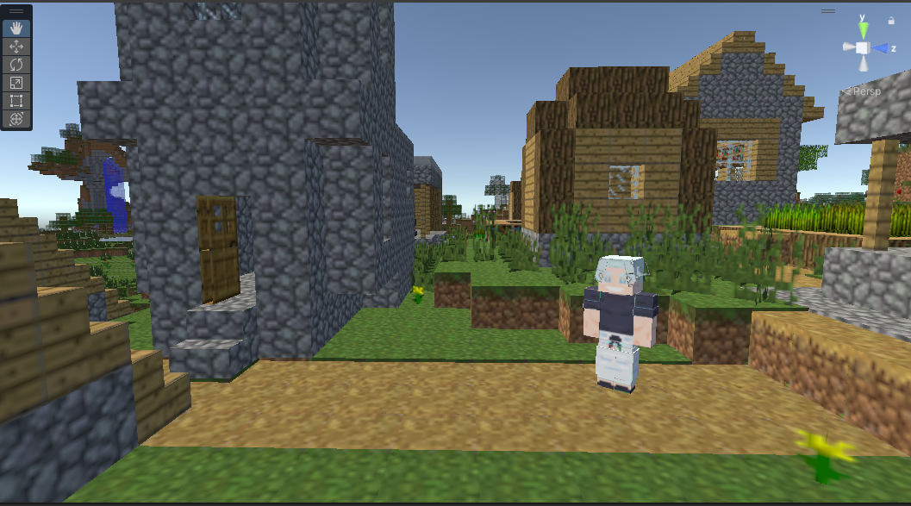

# learning-unity-vr

This repository contains the code for the Unity VR project I created while learning Unity and VR development.

## Assets

-   [Gojo Minecraft](https://sketchfab.com/3d-models/gojo-4eb56d8bba0549e0889ad9a0e67b45fb)
-   [Vila Minecraft](https://sketchfab.com/3d-models/minecraft-village-7a654cb58f72499a9e809927e5cddef8)

## Screenshots

